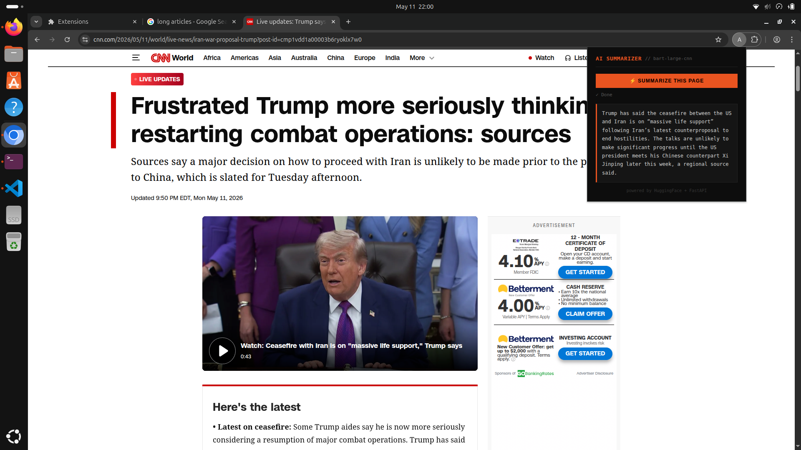

# AI Summarizer — Chrome Extension

One-click AI summarization of articles and emails using HuggingFace BART and FastAPI.

## Tech Stack
- **Backend:** Python, FastAPI, HuggingFace Inference API
- **Model:** facebook/bart-large-cnn
- **Frontend:** Vanilla JS, Chrome Extension Manifest V3

## Features
- Summarizes any article or webpage in one click
- Gmail thread support
- FastAPI backend with average response time under 300ms
- Clean terminal-aesthetic UI

## API
Backend: https://ai-summarizer-e6kv.onrender.com

## Try It
1. Clone this repo: `git clone https://github.com/WaiHlyanMinThein17/ai-summarizer.git`
2. Open Chromium/Chrome → `chrome://extensions`
3. Enable **Developer Mode** (top right)
4. Click **Load unpacked** → select the `extension` folder
5. Visit any article or Gmail thread and click the extension icon

> Note: This extension is not yet published on the Chrome Web Store. 
> Load it manually using the steps above.

## Preview
